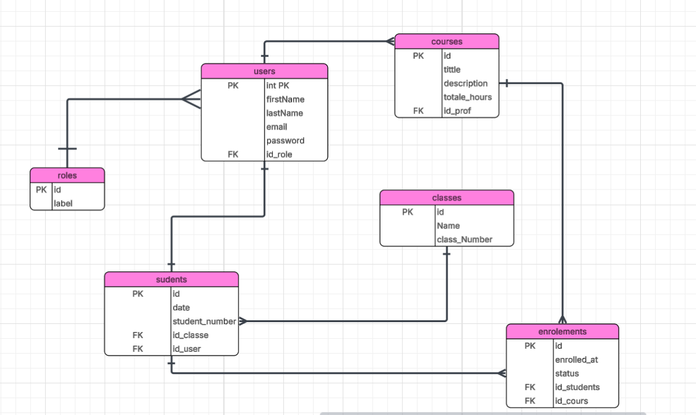

# 🎓 Base de données – Système de gestion scolaire

## 📌 Description du projet

Ce projet consiste à concevoir une base de données relationnelle pour un système de gestion scolaire.

L’objectif principal est de gérer les utilisateurs, les rôles, les étudiants, les classes, les cours et les inscriptions, tout en définissant des relations claires entre les différentes entités.

---

## 🧱 Structure de la base de données

La base de données contient les tables suivantes :

- roles
- users
- classes
- students
- courses
- enrollments

---

## 🔗 Relations entre les tables

### 1️⃣ Relation 1:1 (Un à Un)

#### users ↔ students
- Chaque étudiant possède un seul compte utilisateur.
- Chaque compte utilisateur (type étudiant) correspond à un seul étudiant.

👉 Mise en œuvre :
- `students.user_id` (clé étrangère UNIQUE)

---

### 2️⃣ Relation 1:N (Un à Plusieurs)

#### roles ↔ users
- Un rôle peut être attribué à plusieurs utilisateurs.
- Un utilisateur possède un seul rôle.

#### classes ↔ students
- Une classe peut contenir plusieurs étudiants.
- Un étudiant appartient à une seule classe.

#### users (professeurs) ↔ courses
- Un professeur peut enseigner plusieurs cours.
- Chaque cours est attribué à un seul professeur.

👉 Mise en œuvre :
- Clés étrangères dans les tables du côté "plusieurs"

---

### 3️⃣ Relation N:N (Plusieurs à Plusieurs)

#### students ↔ courses
- Un étudiant peut suivre plusieurs cours.
- Un cours peut contenir plusieurs étudiants.

👉 Cette relation est gérée par la table `enrollments`.

---

## 🧩 Table enrollments

La table `enrollments` est une table de jointure entre les étudiants et les cours.

### Champs :
- student_id (clé étrangère vers students.id)
- course_id (clé étrangère vers courses.id)
- enrolled_at (date d’inscription)
- status (actif / terminé)

### Contrainte :
- Un étudiant ne peut pas s’inscrire deux fois au même cours.

---

## 🛠️ Travail réalisé

- Conception du diagramme ERD (Entity Relationship Diagram)
- Création des tables de la base de données
- Définition des clés primaires et étrangères
- Mise en place des relations entre les tables
- Préparation de l’insertion des données
- Documentation de la structure de la base de données

---

## 🚀 Technologies utilisées

- MySQL / SQL
- Conception de bases de données relationnelles

---

## 📌 ERD Diagramm

